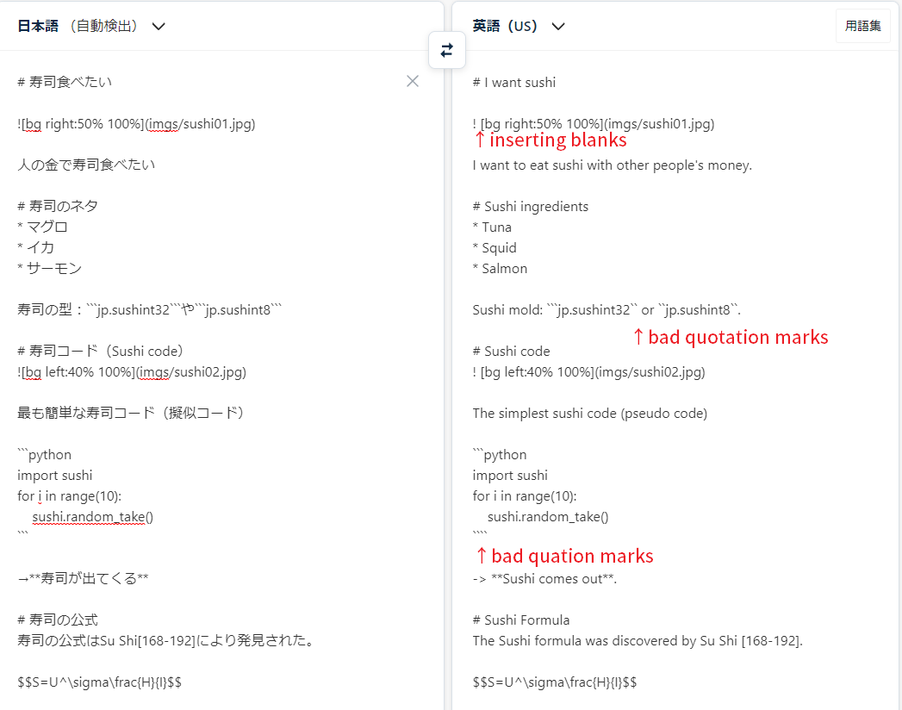
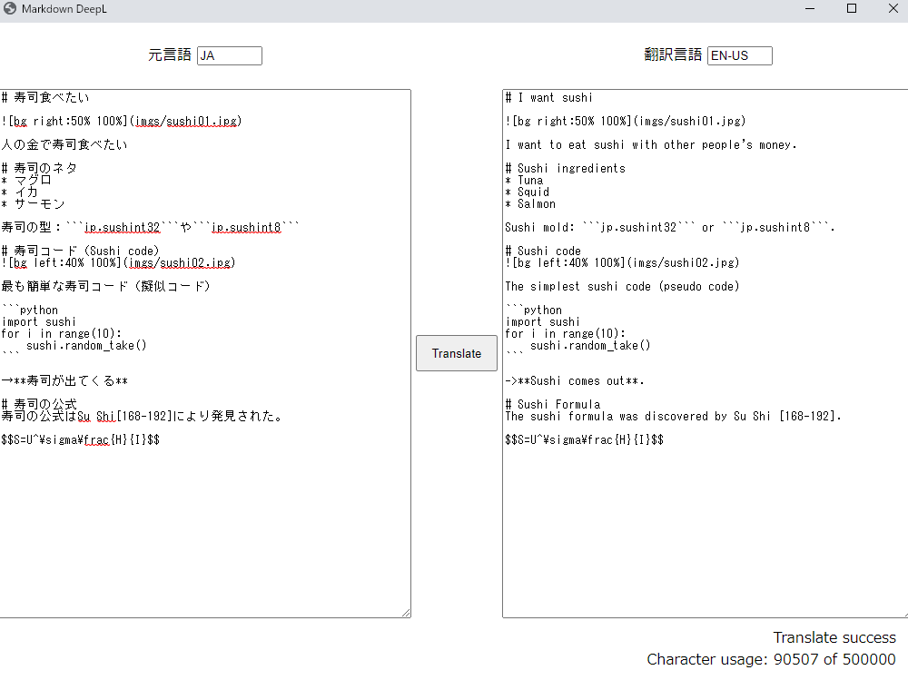

# Markdown DeepL
Very simple application to translate markdown files at DeepL.

https://user-images.githubusercontent.com/12977641/161288924-4c33ff1f-46c0-4be6-9e2b-162362122c36.mp4

This demo also used Marp for slide processing.

## Quick Start

1. register for use of DeepL Pro and issue an **authorization key**.  
 Free version of the API is also available.  
 https://www.deepl.com/ja/pro-account/summary

2. download "markdown_deepl.zip" from the Release tab  
 and open "**config.json**".

```javascript
{
    "auth_key": "", // Insert your authorization key here
    "source_lang": "JA",
    "target_lang": "EN-US"
}
```

3. Run markdown_deepl.exe.

4. Enter the text you wish to translate in the text box on the left.  
 Press the Translate button.

## Differences from the web version
* Split every 5000 characters, so there is no character limit if within API limits
* Regular expressions are used to correct markup discrepancies caused by translation, so you can expect more accurate markup than the web version.

### DeepL web version sample


### This application


## Work with Marp and Reveal.js
When used with Markdown slide creation libraries such as [Marp](https://marp.app/) and [Reveal.js](https://revealjs.com/), you can easily create multilingual presentations!


## Changing source/target language
* 「元言語」：Source language
* 「翻訳言語」：Target language
* Notation : Please refer [deepl api](https://www.deepl.com/ja/pro-api/).

## Replacement rules
The post-translation replacement process is defined in the "rules" folder

The file name is "**{source_lang}_{target_lang}.txt**" and only includes Japanese to English definitions (the reason is that I use only this file).

If you create a rule file, you can customize the rules freely.

### Format
Replacement rules should be written in the following **tab-separated** format.

```console
<search_expression>\t<replacement_expression>
<search_expression>\t<replacement_expression>
: : : 
```

This is interpreted as follows.

```python
import re
for rule in rules:
    translated_string = re.sub(
        rule.search_expression,
        rule_replacement_expression,
        translated_string)
```

#### Important
When using symbols such as ```[]``` in ```<search_expression>```, **please escape them** as in ```\[\]```.

You can also use group notation in Python's ```re.sub```.

## License
This project is under MIT license.

## Update policy
Author does not like to manage issues, so issues with no pull requests will be ignored. I'd rather eat sushi.
