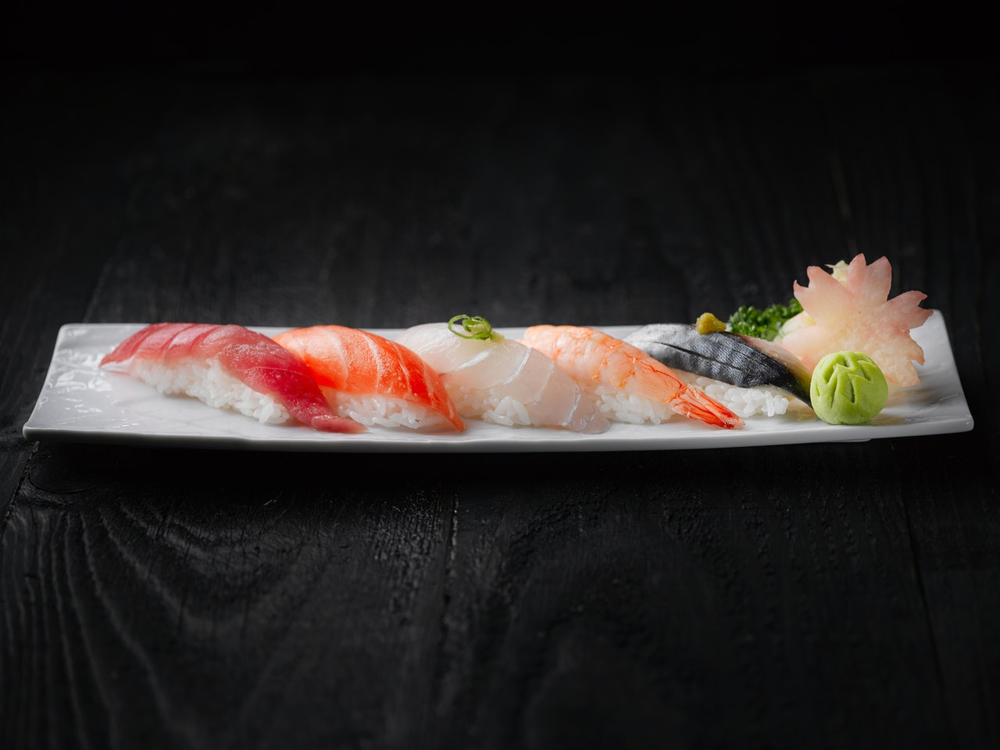

<!--
headingDivider: 1
-->
# 寿司食べたい


人の金で寿司食べたい

# 寿司のネタ
* マグロ
* イカ
* サーモン

寿司の型：```jp.sushint32```や```jp.sushint8```

# 寿司コード（Sushi code）


最も簡単な寿司コード（擬似コード）

```python
import sushi
for i in range(10):
    sushi.random_take()
```

→**寿司が出てくる**

# 寿司の公式
寿司の公式はSu Shi[168-192]により発見された。

$$S=U^\sigma\frac{H}{I}$$
