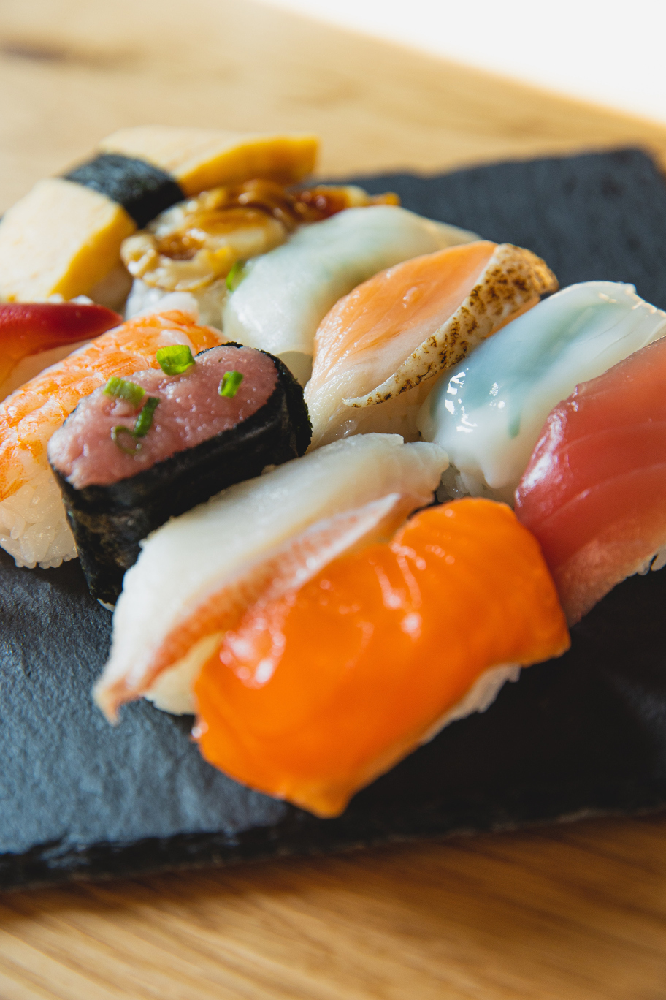
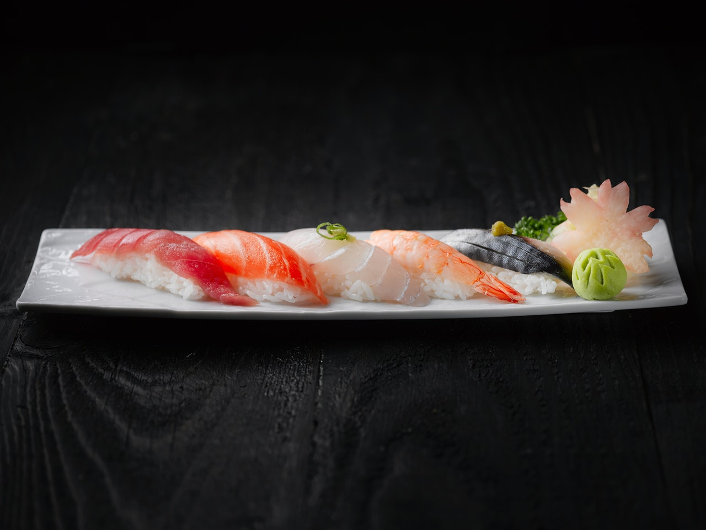

<!--
headingDivider: 1
-->
# I want to eat sushi



I want to eat sushi with other people's money.

# Sushi ingredients
* Tuna
* Squid
* Salmon

Sushi mold: ```jp.sushint32``` or ```jp.sushint8```.

# Sushi code


The simplest sushi code (pseudo code)

```python
import sushi
for i in range(10):
    sushi.random_take()
```

->**Sushi comes out**.

# Sushi Formula
The sushi formula was discovered by Su Shi [168-192].

$$S=U^\sigma\frac{H}{I}$$
